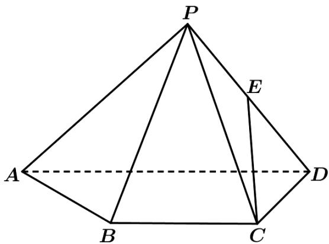

> [!faq]- 《专题21 立体几何大题综合》真题解析
>
> > [!success]- **【答案】** (1) 证明：CE∥平面 PAB； 【答案】（1）见解析； 试题
>
> > [!note]- **【分析】**
> > 本题未单列分析。
>
> > [!note]- **【解析】**
> > 
> > 解析：
> > 
> > (Ⅰ) 如图，设 $PA$ 中点为 $F$ ，连接 $EF$ ， $FB$
> > 因为 $E$ ， $F$ 分别为 $PD$ ， $PA$ 中点，所以 $EF / / AD$ 且 $EF = \frac{1}{2} AD$
> > 又因为 $BC // AD$ ， $BC = \frac{1}{2} AD$ ，所以 $EF // BC$ 且 $EF = BC$ ，
> > 即四边形 $BCEF$ 为平行四边形，所以 $CE // BF$ ，
> > 因此 $CE / /$ 平面PAB.
