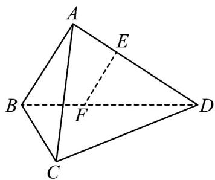

> [!faq]- 《专题21 立体几何大题综合》真题解析
>
> > [!success]- **【答案】** （1）见解析
>
> > [!note]- **【分析】**
> > 本题未单列分析。
>
> > [!note]- **【解析】**
> > 试题分析：（1）先由平面几何知识证明 $EF \parallel AB$ ，再由线面平行判定定理得结论；
> > 试题解析：证明：（1）在平面ABD内，因为 $AB\perp AD$ ， $EF\perp AD$ ，所以 $EF\parallel AB$ 。
> > 
> > 又因为 $EF \not\subset$ 平面 ABC， $AB \subset$ 平面 ABC，所以 $EF \parallel$ 平面 ABC.
