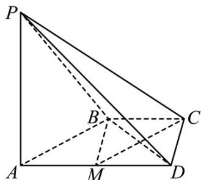

> [!faq]- 《专题21 立体几何大题综合》真题解析
>
> > [!success]- **【答案】** 详见解析
>
> > [!note]- **【分析】**
> > 本题未单列分析。
>
> > [!note]- **【解析】**
> > 【答案】（Ⅰ）详见解析；
> > (Ⅰ) 取棱 $^{AD}$ 的中点 $^{M}$ ( $M \in$ 平面 $^{PAD}$ )，点 $^{M}$ 即为所求的一个点·理由如下：
> > 因为 $AD \parallel BC, BC = \frac{1}{2} AD$ ，所以 $BC \parallel AM$ ，且 BC = AM.
> > 所以四边形 AMCB 是平行四边形，从而 CMIAB.
> > 又 $AB \subset$ 平面 $PAB, CM \notin$ 平面 $PAB,$
> > 所以 CMII 平面 PAB.
> > (说明：取棱 $^{PD}$ 的中点 $^{N}$ ，则所找的点可以是直线 $^{MN}$ 上任意一点)
> > 
