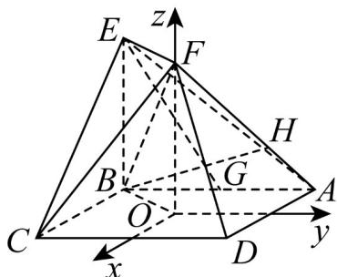

> [!faq]- 《专题21 立体几何大题综合》真题解析
>
> > [!success]- **【答案】** （Ⅰ）详见解析； 试题
>
> > [!note]- **【分析】**
> > 本题未单列分析。
>
> > [!note]- **【解析】**
> > 解析：依题意， $OF \perp$ 平面ABCD，如图，以O为点，分别以AD,BA,OF的方向为x轴、y轴、z轴的正方向建立空间直角坐标系，依题意可得 $O(0,0,0)$ ，
> > $A(-1,1,0),B(-1,-1,0),C(1,-1,0),D(11,0),E(-1,-1,2),F(0,0,2),G(-1,0,0)$ .
> > 
> > (Ⅰ) 证明：依题意， $AD=(2,0,0), AF=(1,-1,2)$ .
> > 设 $n_{1}=\left(x,y,z\right)$ 为平面 $_{ADF}$ 的法向量，则 $\left\{\begin{array}{l}n_{1}\cdot AD=0\\n_{1}\cdot AF=0\end{array}\right.$ ，即 $\left\{\begin{array}{l}2x=0\\x-y+2z=0\end{array}\right.$
> > 不妨设 $z = 1$ ，可得 $\stackrel{\square}{n}_{1} = (0,2,1)$ ，又 $EG = (0,1, - 2)$ ，可得 $EG\cdot n_{1} = 0$
> > 又因为直线 $EG \notin$ 平面 $ADF$ ，所以 $EG //$ 平面 $ADF$ .
