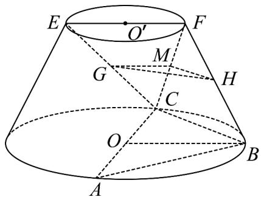

> [!faq]- 《专题21 立体几何大题综合》真题解析
>
> > [!success]- **【答案】** （Ⅰ）见解析；
>
> > [!note]- **【分析】**
> > 本题未单列分析。
>
> > [!note]- **【解析】**
> > (Ⅰ)连结 FC，取 FC 的中点 M，连结 GM，HM，∵ GM // EF 、 EF 在上底面内，GM 不在上底面内，∴ GM // 上底面，
> > ∴ GM // 平面 ABC ， 又 ∵ MH//BC ， BC ⊂ 平面 ABC ， MH ∉ 平面 ABC ，
> > ∴ MH // 平面 ABC ，
> > 
> > 所以平面GHM//平面ABC，由GH⊂平面GHM，∴GH//平面ABC
