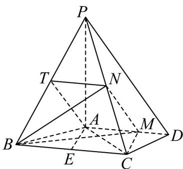

> [!faq]- 《专题21 立体几何大题综合》真题解析
>
> > [!success]- **【答案】** (Ⅰ)证明见解析； 试题
>
> > [!note]- **【分析】**
> > 本题未单列分析。
>
> > [!note]- **【解析】**
> > （1）由已知得 $AM = \frac{2}{3} AD = 2$ ，取 $BP$ 的中点 $T$ ，连接 $AT, TN$ ，由 $N$ 为 $PC$ 中点知 $TN // BC$ ， $TN = \frac{1}{2} BC = 2$ .
> > 又 $AD \parallel BC$ ，故 $TN$ 平行且等于 $AM$ ，四边形 $AMNT$ 为平行四边形，于是 $MN \parallel AT$ 。因为 $AT \subset$ 平面 $PAB$ ， $MN \subset$ 平面 $PAB$ ，所以 $MN \parallel$ 平面 $PAB$ 。
> > 
