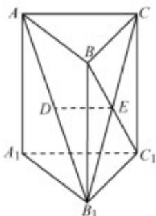

> [!faq]- 《专题21 立体几何大题综合》真题解析
>
> > [!success]- **【答案】** （1）详见解析 试题
>
> > [!note]- **【分析】**
> > 本题未单列分析。
>
> > [!note]- **【解析】**
> > 解析： $\left(^{1}\right)$ 由题意知，E为 $B_{1}C$ 的中点，
> > 又D为 $\mathrm{AB}_{1}$ 的中点，因此DE//AC
> > 又因为 $\mathrm{DE} \notin$ 平面 $\mathrm{AA}_{1}\mathrm{C}_{1}\mathrm{C}$ ， $\mathrm{AC} \subset$ 平面 $\mathrm{AA}_{1}\mathrm{C}_{1}\mathrm{C}$
> > 所以 DE// 平面 $AA_{1}C_{1}C$
> > 
