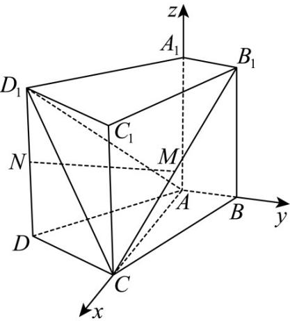

> [!faq]- 《专题21 立体几何大题综合》真题解析
>
> > [!success]- **【答案】** (1) 求证： $MN \parallel$ 平面 ABCD； 【答案】（1）证明见解析；
>
> > [!note]- **【分析】**
> > 本题未单列分析。
>
> > [!note]- **【解析】**
> > 如图，以A为原点建立空间直角坐标系，依题意可得 $A(0,0,0), B(0,1,0), C(2,0,0), D(1,-2,0)$
> > 
> > 又因为 $M, N$ 分别为 $B_{1}C$ 和 $D_{1}D$ 的中点，得 $M\left(1, \frac{1}{2}, 1\right), N(1, -2, 1)$ .
> > （Ⅰ）证明：依题意，可得 $n = (0,0,1)$ 为平面ABCD的一个法向量， $MN = \left(0, -\frac{5}{2}, 0\right)$
> > 由此可得， $MN \cdot n = 0$ ，又因为直线 MN ∉ 平面 ABCD，所以 MN // 平面 ABCD
