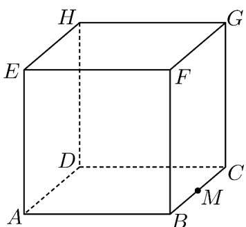
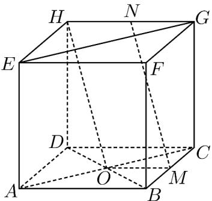

> [!faq]- 《专题21 立体几何大题综合》真题解析
>
> > [!success]- **【答案】** 详见解析
>
> > [!note]- **【分析】**
> > 本题未单列分析。
>
> > [!note]- **【解析】**
> > 【详解】（1）点 $F$ 、 $G$ 、 $H$ 的位置如图所示
> > 
> > (2) 连结 BD，设 O 为 BD 的中点.
> > 
> > 因为 M、N 分别是 BC、GH 的中点，
> > 所以 $NH // CD$ ，且 $NH = \frac{1}{2} CD$
> > MN // OH，且 $NH = \frac{1}{2} CD$ ，
> > 所以 $OM / / NH, OM = NH$
> > 所以 $\angle PKM$ 是平行四边形，从而 $MP \perp AC$
> > 又 $OH \subset$ 平面 BDH ，MN // 平面 BDH ，MN ∉ 平面 BDH ，
> > 所以 $MN / /$ 平面BDH·
