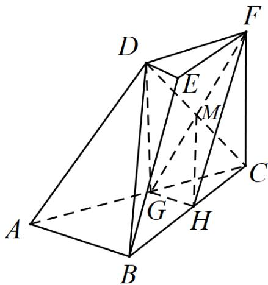
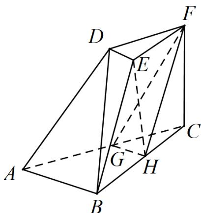

> [!faq]- 《专题21 立体几何大题综合》真题解析
>
> > [!success]- **【答案】** 详见解析
>
> > [!note]- **【分析】**
> > 本题未单列分析。
>
> > [!note]- **【解析】**
> > 【详解】（Ⅰ）证法一：连接 DG, CD. 设 $CD \cap GF = M$ ，连接 MH，在三棱台 DEF - ABC 中，AB = 2DE，G 分别为 AC 的中点，可得 $DF // GC, DF = GC$ ，所以四边形 DFCG 是平行四边形，则 M 为 CD 的中点，又 H 是 BC 的中点，所以 HM // BD，
> > 又 $HM \subset$ 平面 FGH ， BD ∉ 平面 FGH ， 所以 BD // 平面 FGH .
> > 
> > 证法二：在三棱台 $DEF - ABC$ 中，由 $BC = 2EF, H$ 为 $BC$ 的中点，
> > 可得 $BH // EF, BH = EF$ ，所以 HBEF 为平行四边形，可得 $BE // HF$ .
> > 在 $\Delta ABC$ 中，G, H 分别为 AC, BC 的中点，
> > 所以 $GH \parallel AB$ , 又 $GH \cap HF = H$
> > 所以平面 $FGH \parallel$ 平面 $ABED$
> > 因为 $BD \subset$ 平面ABED
> > 所以 BD // 平面 FGH.
> > 
