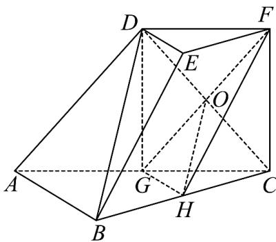

> [!faq]- 《专题21 立体几何大题综合》真题解析
>
> > [!success]- **【答案】** 试题
>
> > [!note]- **【分析】**
> > 本题未单列分析。
>
> > [!note]- **【解析】**
> > (Ⅰ) 证法一：连接 DG, CD，设 $CD \cap GF = O$ ，连接 OH
> > 在三棱台 DEF-ABC 中，
> > $AB = 2DE, G$ 为 $AC$ 的中点
> > 可得 $DF / / GC,DF = GC$
> > 所以四边形 $DFCG$ 为平行四边形
> > 则 $O$ 为 $CD$ 的中点
> > 又 $H$ 为 $BC$ 的中点
> > 所以 $OH \parallel BD$
> > 又 $OH \subset$ 平面 FGH, BD $\subsetneq$ 平面 FGH,
> > 所以 $BD / /$ 平面FGH
> > 
> > 证法二：
> > 在三棱台 DEF-ABC 中，
> > 由 $BC = 2EF, H$ 为 $BC$ 的中点
> > 可得 $BH / / EF, BH = EF,$
> > 所以四边形 BHFE 为平行四边形
> > 可得 $BE / / HF$
> > 在 $\Delta ABC$ 中，G 为 AC 的中点，H 为 BC 的中点，
> > 所以 GH // AB
> > 又 $GH \cap HF = H$ ，所以平面 $FGH //$ 平面 $ABED$
> > 因为 $BD \subset$ 平面ABED
> > 所以 $BD / /$ 平面FGH
