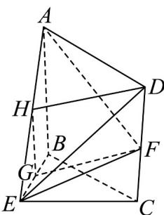

> [!faq]- 《专题21 立体几何大题综合》真题解析
>
> > [!success]- **【答案】** (1)求证： $GF \parallel$ 平面 ADE；
>
> > [!note]- **【分析】**
> > 本题未单列分析。
>
> > [!note]- **【解析】**
> > （1）如图，取 $AE$ 的中点 $H$ 连接 $HG$ ， $HD$ ，又 $G$ 是 $BE$ 的中点，
> > 
> > 所以 $HG // AB$ ，且 $HG = \frac{1}{2} AB$
> > 又 $F$ 是 $CD$ 中点，所以 $DF = \frac{1}{2} CD$
> > 由四边形 ABCD 是矩形得， $AB \parallel CD$ ，AB = CD，
> > 所以 GH // DF 且 GH = DF .
> > 从而四边形 HGFD 是平行四边形，所以 GF//DH
> > ∵DH⊂平面ADE，GF∉平面ADE，∴GF//平面ADE.
