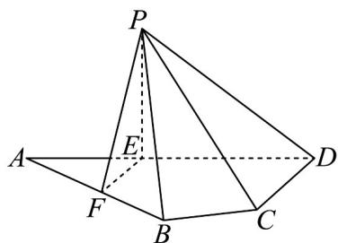

<!-- question-source:start -->
1．（2024·全国新Ⅱ卷·高考真题）如图，平面四边形ABCD中，AB=8，CD=3， $AD=5\sqrt{3}$

$\angle ADC = 90^{\circ}$ ， $\angle BAD = 30^{\circ}$ ，点 $E$ ， $F$ 满足 $\overline{AE} = \frac{2}{5}\overline{AD}$ ， $\overline{AF} = \frac{1}{2}\overline{AB}$ ，将 $\triangle AEF$ 沿 $EF$ 翻折至！ $PEF$ ，使得 $PC = 4\sqrt{3}$

(1)证明： $EF \perp PD$ ；

(2)求平面 $PCD$ 与平面 $PBF$ 所成的二面角的正弦值.
<!-- question-source:end -->

![[高中/真题/按题型分类/专题21 立体几何大题综合/考点02_空间中的垂直关系_第一问_/真题/answers/Q00035780A1.md]]
