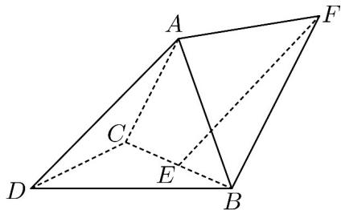

<!-- question-source:start -->
2．（2023·全国新Ⅱ卷·高考真题）如图，三棱锥 A-BCD 中，DA=DB=DC，BD⊥CD， $\angle ADB = \angle ADC = 60^{\circ}$ ，E 为 BC 的中点。

<!-- question-source:end -->

![[高中/真题/按题型分类/专题21 立体几何大题综合/考点02_空间中的垂直关系_第一问_/真题/answers/Q00035781A1.md]]
