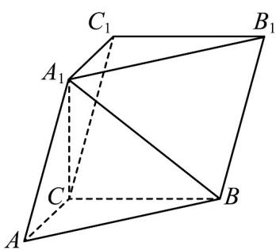

<!-- question-source:start -->
3. (2023·全国甲卷·高考真题) 如图，在三棱柱 $ABC - A_{1}B_{1}C_{1}$ 中， $A_{1}C \perp$ 平面 $ABC, \angle ACB = 90^{\circ}$

(1)证明：平面 $ACC_{1}A_{1} \perp$ 平面 $BB_{1}C_{1}C$

(2)设 $AB = A_{1}B, AA_{1} = 2$ ，求四棱锥 $A_{1} - BB_{1}C_{1}C$ 的高.
<!-- question-source:end -->

![[高中/真题/按题型分类/专题21 立体几何大题综合/考点02_空间中的垂直关系_第一问_/真题/answers/Q00035782A1.md]]
