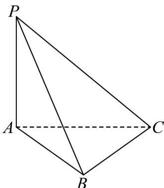

<!-- question-source:start -->
4．（2023·北京·高考真题）如图，在三棱锥 P-ABC 中， $PA \perp$ 平面 ABC， $PA = AB = BC = 1, PC = \sqrt{3}$

(1)求证： $BC \perp$ 平面 PAB；

(2)求二面角 A - PC - B 的大小.
<!-- question-source:end -->

![[高中/真题/按题型分类/专题21 立体几何大题综合/考点02_空间中的垂直关系_第一问_/真题/answers/Q00035783A1.md]]
