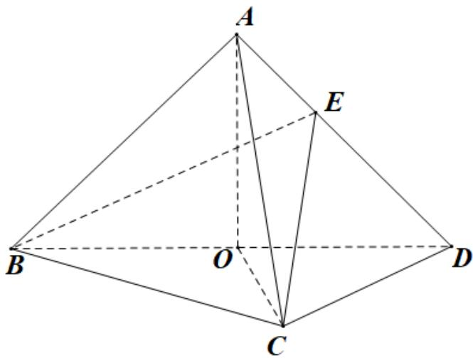

<!-- question-source:start -->
8. (2021·全国新I卷·高考真题) 如图，在三棱锥 A-BCD 中，平面 $ABD \perp$ 平面 BCD，AB = AD，O 为

BD的中点·

<!-- question-source:end -->

![[高中/真题/按题型分类/专题21 立体几何大题综合/考点02_空间中的垂直关系_第一问_/真题/answers/Q00035787A1.md]]
