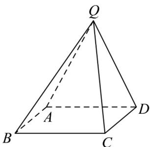

<!-- question-source:start -->
9．（2021·全国新Ⅱ卷·高考真题）在四棱锥Q-ABCD中，底面ABCD是正方形，若AD=2,QD=QA= $\sqrt{5}$ ,QC=3.

<!-- question-source:end -->

![[高中/真题/按题型分类/专题21 立体几何大题综合/考点02_空间中的垂直关系_第一问_/真题/answers/Q00035788A1.md]]
