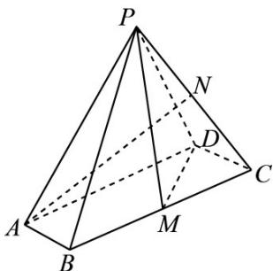

<!-- question-source:start -->
12．（2021·浙江·高考真题）如图，在四棱锥P-ABCD中，底面ABCD是平行四边形， $\angle ABC=120^{\circ},AB=1,BC=4,PA=\sqrt{15}$ ，M，N分别为BC,PC的中点， $PD\perp DC,PM\perp MD$

<!-- question-source:end -->

![[高中/真题/按题型分类/专题21 立体几何大题综合/考点02_空间中的垂直关系_第一问_/真题/answers/Q00035791A1.md]]
