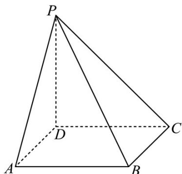

<!-- question-source:start -->
13. (2020·海南·高考真题) 如图, 四棱锥 $P-ABCD$ 的底面为正方形, $PD \perp$ 底面 $ABCD$ . 设平面 $PAD$ 与平面 $PBC$ 的交线为 $l$ .

(1) 证明： $l \perp$ 平面 PDC；

(2) 已知 $PD = AD = 1$ ， $Q$ 为 $l$ 上的点， $QB = \sqrt{2}$ ，求 $PB$ 与平面 $QCD$ 所成角的正弦值。
<!-- question-source:end -->

![[高中/真题/按题型分类/专题21 立体几何大题综合/考点02_空间中的垂直关系_第一问_/真题/answers/Q00035792A1.md]]
