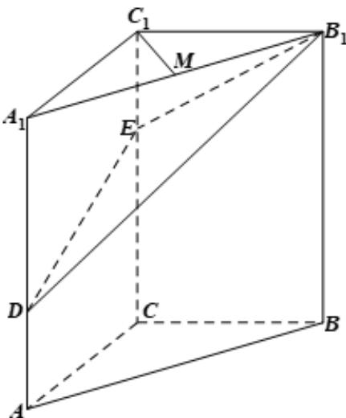

<!-- question-source:start -->
14．（2020·天津·高考真题）如图，在三棱柱 $ABC-A_{1}B_{1}C_{1}$ 中， $CC_{1}\perp$ 平面 $ABC,AC\perp BC,AC=BC=2$ ， $CC_{1}=3$ ，点D，E分别在棱 $AA_{1}$ 和棱 $CC_{1}$ 上，且AD=1 CE=2，M为棱 $A_{1}B_{1}$ 的中点.

(Ⅰ) 求证： $C_{1}M \perp B_{1}D$ ；

(Ⅱ) 求二面角 $B - B_{1}E - D$ 的正弦值；

(Ⅲ) 求直线 AB 与平面 $DB_{1}E$ 所成角的正弦值.
<!-- question-source:end -->

![[高中/真题/按题型分类/专题21 立体几何大题综合/考点02_空间中的垂直关系_第一问_/真题/answers/Q00035793A1.md]]
