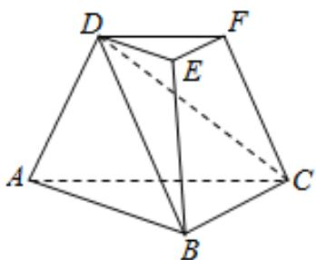

<!-- question-source:start -->
15. （2020·浙江·高考真题）如图，三棱台 $ABC-DEF$ 中，平面 $ACFD \perp$ 平面 $ABC$ ， $\angle ACB = \angle ACD = 45^\circ$ ， $DC = 2BC$ 。

<!-- question-source:end -->

![[高中/真题/按题型分类/专题21 立体几何大题综合/考点02_空间中的垂直关系_第一问_/真题/answers/Q00035794A1.md]]
