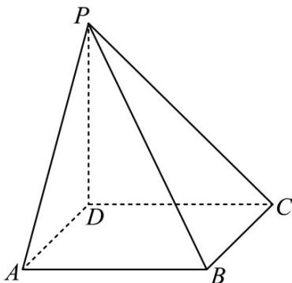

<!-- question-source:start -->
16. （2020·山东·高考真题）如图，四棱锥 P-ABCD 的底面为正方形， $PD^{\perp}$ 底面 ABCD．设平面 PAD 与平面 PBC 的交线为 l．

<!-- question-source:end -->

![[高中/真题/按题型分类/专题21 立体几何大题综合/考点02_空间中的垂直关系_第一问_/真题/answers/Q00035795A1.md]]
