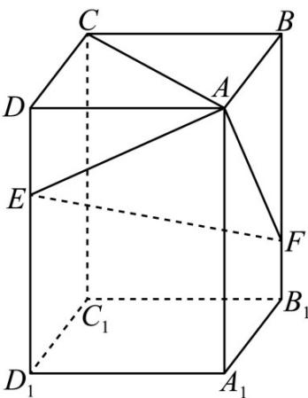

<!-- question-source:start -->
17. (2020·全国·高考真题) 如图, 在长方体 $ABCD - A_1B_1C_1D_1$ 中, 点 $E$ , $F$ 分别在棱 $DD_1$ , $BB_1$ 上, 且

$2DE = ED_{1}$ ， $BF = 2FB_{1}$ .证明：

(1) 当 AB = BC 时， $EF \perp AC$ ；

(2) 点 $C_1$ 在平面 $AEF$ 内.
<!-- question-source:end -->

![[高中/真题/按题型分类/专题21 立体几何大题综合/考点02_空间中的垂直关系_第一问_/真题/answers/Q00035796A1.md]]
