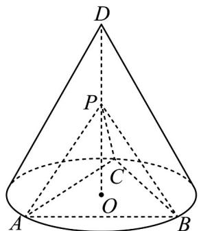

<!-- question-source:start -->
18. (2020·全国·高考真题) 如图, $D$ 为圆锥的顶点, $O$ 是圆锥底面的圆心, $\triangle ABC$ 是底面的内接正三角形, $P$ 为 $DO$ 上一点, $\angle APC = 90^{\circ}$ .

<!-- question-source:end -->

![[高中/真题/按题型分类/专题21 立体几何大题综合/考点02_空间中的垂直关系_第一问_/真题/answers/Q00035797A1.md]]
