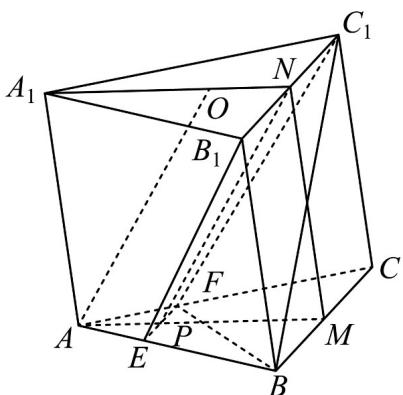

<!-- question-source:start -->
20．（2020·全国·高考真题）如图，已知三棱柱 $ABC-A_{1}B_{1}C_{1}$ 的底面是正三角形，侧面 $BB_{1}C_{1}C$ 是矩形，M，N 分别为 BC， $B_{1}C_{1}$ 的中点，P 为 AM 上一点．过 $B_{1}C_{1}$ 和 P 的平面交 AB 于 E，交 AC 于 F．

<!-- question-source:end -->

![[高中/真题/按题型分类/专题21 立体几何大题综合/考点02_空间中的垂直关系_第一问_/真题/answers/Q00035799A1.md]]
