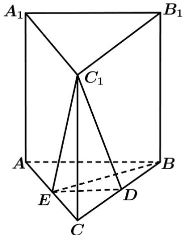

<!-- question-source:start -->
22. (2019·江苏·高考真题) 如图, 在直三棱柱 $ABC - A_{1}B_{1}C_{1}$ 中, $D$ , $E$ 分别为 $BC$ , $AC$ 的中点, $AB=BC$ .

求证： $\left(^{1}\right)A_{l}B_{l}^{\parallel}$ 平面 $DEC_{l}$ ；

(2) $BE \perp C_{l}E$ .
<!-- question-source:end -->

![[高中/真题/按题型分类/专题21 立体几何大题综合/考点02_空间中的垂直关系_第一问_/真题/answers/Q00035801A1.md]]
