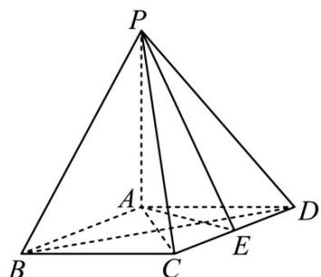

<!-- question-source:start -->
23. (2019·北京·高考真题) 如图, 在四棱锥 $P - ABCD$ 中, $PA \perp$ 平面 $ABCD$ , 底部 $ABCD$ 为菱形, $E$ 为 $CD$ 的中点.

(Ⅰ) 求证： $BD^{\perp}$ 平面 PAC；

(Ⅱ) 若 $\angle ABC=60^{\circ}$ ，求证：平面 $PAB\perp$ 平面 PAE；

(Ⅲ) 棱 $PB$ 上是否存在点 $F$ , 使得 $CF^{\parallel}$ 平面 $PAE$ ? 说明理由·
<!-- question-source:end -->

![[高中/真题/按题型分类/专题21 立体几何大题综合/考点02_空间中的垂直关系_第一问_/真题/answers/Q00035802A1.md]]
