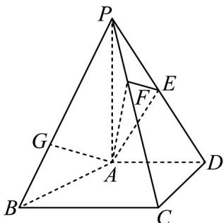

<!-- question-source:start -->
24. (2019·北京·高考真题) 如图，在四棱锥 $P-ABCD$ 中， $PA^{\perp}$ 平面 $ABCD$ ， $AD^{\perp}CD$ ， $AD^{\parallel}BC$ ，

$PA=AD=CD=2$ , $BC=3$ . E 为 PD 的中点，点 F 在 PC 上，且 $\frac{PF}{PC}=\frac{1}{3}$ .

(Ⅰ) 求证： $CD^{\perp}$ 平面 PAD；

(Ⅱ) 求二面角 F-AE-P 的余弦值；

（Ⅲ）设点 $G$ 在 $PB$ 上，且 $\frac{PG}{PB} = \frac{2}{3}$ 。判断直线 $AG$ 是否在平面 $AEF$ 内，说明理由。

<!-- question-source:end -->

![[高中/真题/按题型分类/专题21 立体几何大题综合/考点02_空间中的垂直关系_第一问_/真题/answers/Q00035803A1.md]]
