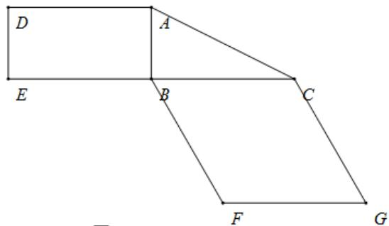
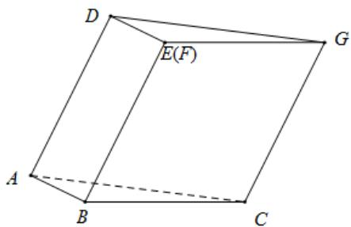

<!-- question-source:start -->
25. (2019·全国·高考真题) 图 1 是由矩形 $ADEB, Rt\Delta ABC$ 和菱形 $BFGC$ 组成的一个平面图形，其中

$AB = 1, BE = BF = 2$ ， $\angle FBC = 60^{\circ}$ ，将其沿 $AB, BC$ 折起使得 $BE$ 与 $BF$ 重合，连结 $DG$ ，如图2.（1）证明图2中的 $A, C, G, D$ 四点共面，且平面 $ABC \perp$ 平面 $BCGE$ ；

(2) 求图 2 中的四边形 ACGD 的面积.

图1
图2
<!-- question-source:end -->

![[高中/真题/按题型分类/专题21 立体几何大题综合/考点02_空间中的垂直关系_第一问_/真题/answers/Q00035804A1.md]]
