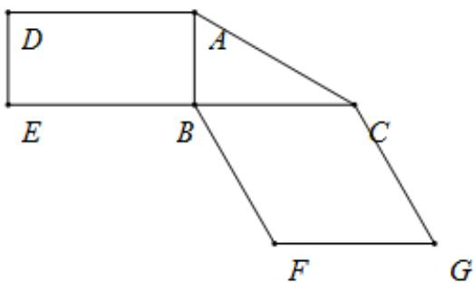
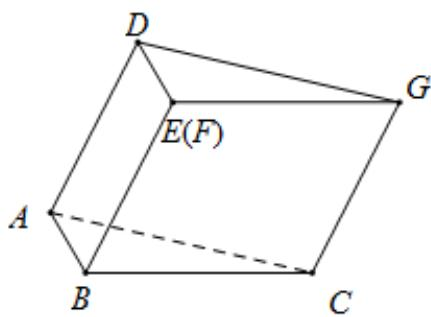

<!-- question-source:start -->
26.（2019·全国·高考真题）图 $^{1}$ 是由矩形 ADEB，Rt△ABC 和菱形 BFGC 组成的一个平面图形，其中 AB=1，BE=BF=2，∠FBC=60°，将其沿 AB，BC 折起使得 BE 与 BF 重合，连结 DG，如图 $^{2}$ .

(1) 证明：图2中的 $A, C, G, D$ 四点共面，且平面 $ABC^{\perp}$ 平面 $BCGE$ ；

(2) 求图 2 中的二面角 B-CG-A 的大小.

图1

图2
<!-- question-source:end -->

![[高中/真题/按题型分类/专题21 立体几何大题综合/考点02_空间中的垂直关系_第一问_/真题/answers/Q00035805A1.md]]
