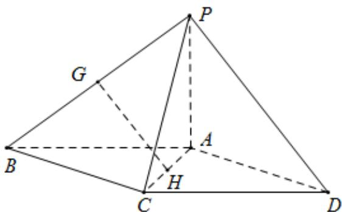

<!-- question-source:start -->
27．（2019·天津·高考真题）如图，在四棱锥 P-ABCD 中，底面 ABCD 为平行四边形， $\triangle PCD$ 为等边三角形，平面 PAC⊥平面 PCD，PA⊥CD，CD=2，AD=3，

<!-- question-source:end -->

![[高中/真题/按题型分类/专题21 立体几何大题综合/考点02_空间中的垂直关系_第一问_/真题/answers/Q00035806A1.md]]
