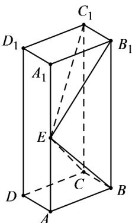

<!-- question-source:start -->
29．（2019·全国·高考真题）如图，长方体 $ABCD-A_{1}B_{1}C_{1}D_{1}$ 的底面ABCD是正方形，点E在棱 $AA_{1}$ 上， $BE\perp EC_{1}$ .

<!-- question-source:end -->

![[高中/真题/按题型分类/专题21 立体几何大题综合/考点02_空间中的垂直关系_第一问_/真题/answers/Q00035808A1.md]]
