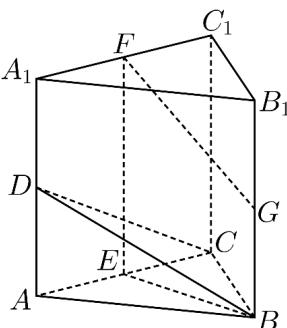

<!-- question-source:start -->
32．（2018·北京·高考真题）如图，在三棱柱 $ABC-A_{1}B_{1}C_{1}$ 中， $CC_{1}\perp$ 平面ABC，D，E，F，G分别为 $AA_{1}$ ，AC， $A_{1}C_{1}$ ， $BB_{1}$ 的中点， $AB=BC=\sqrt{5}$ ， $AC=AA_{1}=2$ 。

(1) 求证： $AC^{\perp}$ 平面 BEF；

(2) 求二面角 $B-CD^{-}C_{l}$ 的余弦值；

(3) 证明：直线 FG 与平面 BCD 相交。
<!-- question-source:end -->

![[高中/真题/按题型分类/专题21 立体几何大题综合/考点02_空间中的垂直关系_第一问_/真题/answers/Q00035810A1.md]]
