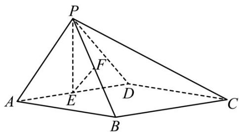

<!-- question-source:start -->
33．（2018·北京·高考真题）如图，在四棱锥 P-ABCD 中，底面 ABCD 为矩形，平面 PAD⊥平面 ABCD， $PA \perp PD$ ，PA = PD，E、F 分别为 AD、PB 的中点.

(Ⅰ) 求证： $PE \perp BC$ ；

(Ⅱ) 求证：平面 $PAB \perp$ 平面 PCD；

(Ⅲ) 求证： $EF \parallel$ 平面 PCD.
<!-- question-source:end -->

![[高中/真题/按题型分类/专题21 立体几何大题综合/考点02_空间中的垂直关系_第一问_/真题/answers/Q00035811A1.md]]
