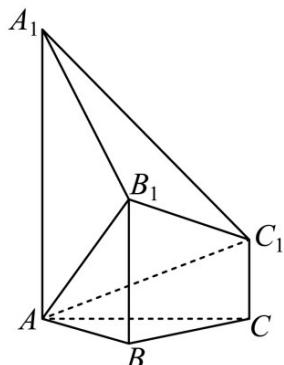

<!-- question-source:start -->
35.（2018·浙江·高考真题）如图，已知多面体 $ABC-A_{1}B_{1}C_{1},A_{1}A,B_{1}B,C_{1}C$ 均垂直于平面 $ABC,\angle ABC=120^{\circ},A_{1}A=4,C_{1}C=1,AB=BC=B_{1}B=2$

(Ⅰ) 求证： $AB_{1} \perp$ 平面 $A_{1}B_{1}C_{1}$ ;

(Ⅱ) 求直线 $AC_{1}$ 与平面 $ABB_{1}$ 所成角的正弦值.
<!-- question-source:end -->

![[高中/真题/按题型分类/专题21 立体几何大题综合/考点02_空间中的垂直关系_第一问_/真题/answers/Q00035813A1.md]]
