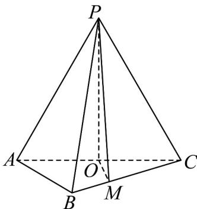

<!-- question-source:start -->
36.（2018·全国·高考真题）如图，在三棱锥 $P - ABC$ 中， $AB = BC = 2\sqrt{2}$ ， $PA = PB = PC = AC = 4$ ， $O$ 为 $AC$ 的中点。

(1) 证明： $PO \perp$ 平面 ABC；

(2) 若点 $M$ 在棱 $BC$ 上，且 $MC = 2MB$ ，求点 $C$ 到平面 $POM$ 的距离.

<!-- question-source:end -->

![[高中/真题/按题型分类/专题21 立体几何大题综合/考点02_空间中的垂直关系_第一问_/真题/answers/Q00035814A1.md]]
