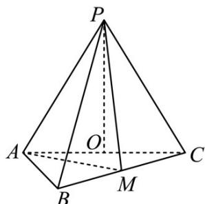

<!-- question-source:start -->
38．（2018·全国·高考真题）如图，在三棱锥 P-ABC 中， $AB=BC=2\sqrt{2}$ ，PA=PB=PC=AC=4，O 为 AC 的中点．

<!-- question-source:end -->

![[高中/真题/按题型分类/专题21 立体几何大题综合/考点02_空间中的垂直关系_第一问_/真题/answers/Q00035816A1.md]]
