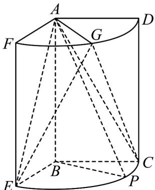

<!-- question-source:start -->
41．（2018·全国·高考真题）如图，几何体是圆柱的一部分，它是由矩形ABCD(及其内部)以AB边所在直线为旋转轴旋转 $120^{\circ}$ 得到的，G是DF的中点.

<!-- question-source:end -->

![[高中/真题/按题型分类/专题21 立体几何大题综合/考点02_空间中的垂直关系_第一问_/真题/answers/Q00035819A1.md]]
