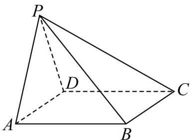

<!-- question-source:start -->
43. (2017·全国·高考真题) 如图，在四棱锥 $P - ABCD$ 中， $AB // CD$ ，且 $\angle BAP = \angle CDP = 90^\circ$ .

(1) 证明：平面 $PAB \perp$ 平面 PAD；

(2) 若 $PA = PD = AB = DC$ ， $\angle APD = 90^{\circ}$ ，求二面角 $A - PB - C$ 的余弦值.
<!-- question-source:end -->

![[高中/真题/按题型分类/专题21 立体几何大题综合/考点02_空间中的垂直关系_第一问_/真题/answers/Q00035821A1.md]]
