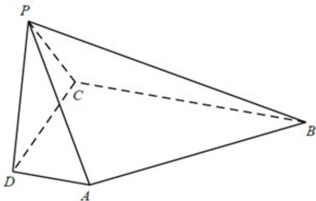

<!-- question-source:start -->
44.（2017·天津·高考真题）如图，在四棱锥 $P - ABCD$ 中， $AD \perp$ 平面 $PDC$ ， $AD \parallel BC$ ， $PD \perp PB$

$AD = 1, BC = 3, CD = 4, PD = 2.$

(1) 求异面直线 AP 与 BC 所成角的余弦值；

(Ⅱ) 求证： $PD \perp$ 平面 PBC；

(Ⅲ) 求直线 AB 与平面 PBC 所成角的正弦值.

<!-- question-source:end -->

![[高中/真题/按题型分类/专题21 立体几何大题综合/考点02_空间中的垂直关系_第一问_/真题/answers/Q00035822A1.md]]
