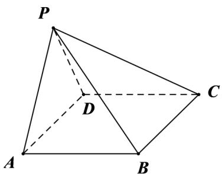

<!-- question-source:start -->
46. (2017·全国·高考真题) 如图，在四棱锥 $P - ABCD$ 中， $AB \parallel CD$ ，且 $\angle BAP = \angle CDP = 90^{\circ}$ .

<!-- question-source:end -->

![[高中/真题/按题型分类/专题21 立体几何大题综合/考点02_空间中的垂直关系_第一问_/真题/answers/Q00035824A1.md]]
