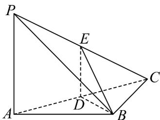

<!-- question-source:start -->
47．（2017·北京·高考真题）如图，在三棱锥 P-ABC 中， $PA \perp AB$ ， $PA \perp BC$ ， $AB \perp BC$ ， $PA = AB = BC = 2$ ，D 为线段 AC 的中点，E 为线段 PC 上一点·

<!-- question-source:end -->

![[高中/真题/按题型分类/专题21 立体几何大题综合/考点02_空间中的垂直关系_第一问_/真题/answers/Q00035825A1.md]]
