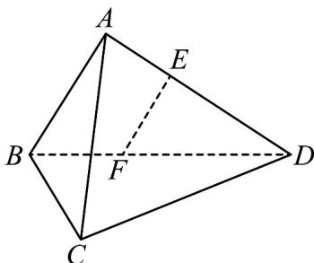

<!-- question-source:start -->
48. (2017·江苏·高考真题) 如图, 在三棱锥 $ABCD$ 中, $AB \perp AD$ , $BC \perp BD$ , 平面 $ABD \perp$ 平面 $BCD$ , 点 $E$ , $F(E$ 与 $A$ , $D$ 不重合)分别在棱 $AD$ , $BD$ 上, 且 $EF \perp AD$ .

求证：(1) $EF\parallel$ 平面 ABC；

(2) $AD \perp AC.$
<!-- question-source:end -->

![[高中/真题/按题型分类/专题21 立体几何大题综合/考点02_空间中的垂直关系_第一问_/真题/answers/Q00035826A1.md]]
