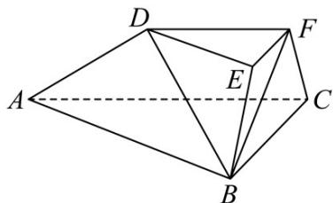

<!-- question-source:start -->
49. (2016·浙江·高考真题) 如图, 在三棱台 ABC-DEF 中, 平面 BCFE⊥平面 ABC, $\angle ACB=90^{\circ}$ ,

BE=EF=FC=1 BC=2 AC=3.

(Ⅰ) 求证： $BF \perp$ 平面 ACFD；

(II) 求直线 $BD$ 与平面 $ACFD$ 所成角的余弦值.
<!-- question-source:end -->

![[高中/真题/按题型分类/专题21 立体几何大题综合/考点02_空间中的垂直关系_第一问_/真题/answers/Q00035827A1.md]]
