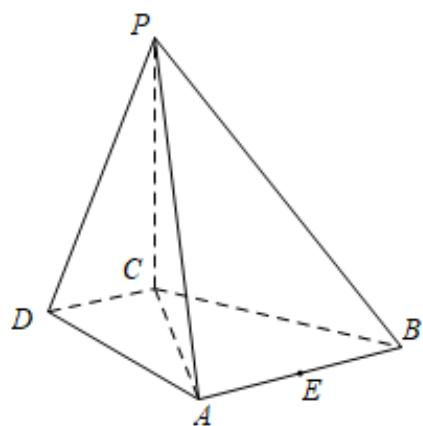

<!-- question-source:start -->
50. (2016·北京·高考真题) 如图, 在四棱锥 $P - ABCD$ 中, $PC \perp$ 平面 $ABCD$ , $AB \parallel DC, DC \perp AC$ .

(Ⅰ) 求证： $DC \perp$ 平面PAC；

(Ⅱ) 求证：平面 $PAB \perp$ 平面 $PAC$ ；

（III）设点 $E$ 为 $AB$ 的中点，在棱 $PB$ 上是否存在点 $F$ ，使得 $\mathrm{PA} / /$ 平面 $CEF?$ 说明理由
<!-- question-source:end -->

![[高中/真题/按题型分类/专题21 立体几何大题综合/考点02_空间中的垂直关系_第一问_/真题/answers/Q00035828A1.md]]
