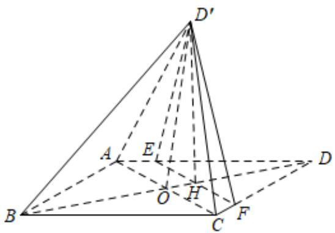

<!-- question-source:start -->
51．（2016·全国·高考真题）如图，菱形ABCD的对角线AC与BD交于点O，点E,F分别在AD,CD上，AE=CF,EF交BD于点H，将ΔDEF沿EF折起到ΔD'EF的位置.

(Ⅰ) 证明： $AC \perp HD'$ ;

(Ⅱ)若 $AB = 5, AC = 6, AE = \frac{5}{4}, OD' = 2\sqrt{2}$ ，求五棱锥 $D' - ABCFE$ 的体积.
<!-- question-source:end -->

![[高中/真题/按题型分类/专题21 立体几何大题综合/考点02_空间中的垂直关系_第一问_/真题/answers/Q00035829A1.md]]
