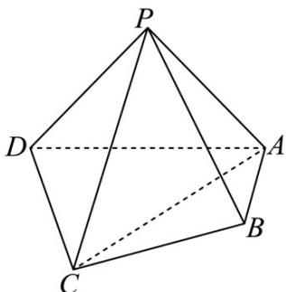

<!-- question-source:start -->
52．（2016·北京·高考真题）如图，在四棱锥 P-ABCD 中，平面 PAD⊥平面 ABCD，PA⊥PD，PA=PD， $AB \perp AD$ ，AB = 1，AD = 2，AC = CD = $\sqrt{5}$ .

<!-- question-source:end -->

![[高中/真题/按题型分类/专题21 立体几何大题综合/考点02_空间中的垂直关系_第一问_/真题/answers/Q00035830A1.md]]
