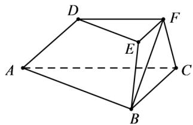

<!-- question-source:start -->
54．（2016·浙江·高考真题）如图，在三棱台 ABC-DEF 中，平面 BCFE ⊥ 平面 ABC, $\angle ACB = 90^{\circ}$ , BC = 2, AC = 3, BE = EF = FC = 1.

(Ⅰ) 求证： $BF \perp$ 平面 ACFD；

(Ⅱ) 求二面角 B-AD-F 的平面角的余弦值.
<!-- question-source:end -->

![[高中/真题/按题型分类/专题21 立体几何大题综合/考点02_空间中的垂直关系_第一问_/真题/answers/Q00035831A1.md]]
