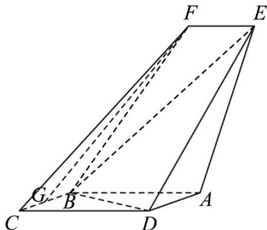

<!-- question-source:start -->
55. (2016·天津·高考真题) 如图, 四边形 $ABCD$ 是平行四边形, 平面 $AED \perp$ 平面 $ABCD$ , $EF||AB$ , $AB=2$ , $BC=EF=1$ , $AE=\sqrt{6}$ , $DE=3$ , $\angle BAD=60^{\circ}$ , $G$ 为 $BC$ 的中点.

(Ⅰ) 求证：FG||平面 BED；

(II) 求证：平面 $BED \perp$ 平面 AED；

(III) 求直线 $^{EF}$ 与平面 $^{BED}$ 所成角的正弦值.
<!-- question-source:end -->

![[高中/真题/按题型分类/专题21 立体几何大题综合/考点02_空间中的垂直关系_第一问_/真题/answers/Q00035832A1.md]]
